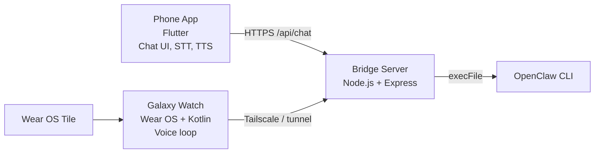

# openclaw-voice

OpenClaw를 휴대폰과 Galaxy Watch에서 음성으로 쓰기 위한 push-to-talk 인터페이스입니다.

Voice interface for OpenClaw AI on Android phones and Galaxy Watch.


## 무엇을 만들었나

`openclaw-voice`는 터미널 중심의 OpenClaw 사용 경험을 폰과 워치의 음성 루프로 확장합니다. Flutter 기반 폰 앱, Kotlin/Wear OS 워치 앱, Node.js 브리지 서버가 함께 동작하며 STT -> OpenClaw CLI -> TTS 흐름을 하나의 음성 인터페이스로 묶습니다.

It extends OpenClaw beyond the terminal with a phone and wearable voice loop. The stack combines a Flutter phone app, Kotlin/Wear OS watch app, and a Node.js bridge server that connects STT, OpenClaw CLI execution, and TTS.

## 주요 기능

- **Phone app**: Flutter 채팅 UI, 음성 입력, OpenClaw 응답 호출, TTS 재생, 세션 저장
- **Watch app**: Galaxy Watch 단독 음성 루프, Wear OS Tile 실행, 진동 피드백, 부분 transcript 표시
- **Bridge server**: 로컬 OpenClaw CLI를 호출하는 Node.js proxy, `/api/chat`, `/api/tunnel-url` 제공
- **Private connectivity**: Tailscale 우선, 워치 직접 접속이 어려울 때 tunnel fallback
- **Korean-first defaults**: 현재 STT/TTS 기본값은 한국어 기준

## 아키텍처



## 기술 스택

| Layer | Stack | Notes |
|---|---|---|
| Phone app | Flutter, Riverpod, `speech_to_text`, `flutter_tts` | Android-first push-to-talk client |
| Watch app | Kotlin, Compose for Wear OS, `SpeechRecognizer`, `TextToSpeech`, OkHttp | Standalone wearable AI client |
| Bridge server | Node.js, Express | Local proxy for OpenClaw CLI |
| Connectivity | Tailscale, optional tunnel fallback | Designed for private network access |

## 프로젝트 구조

```text
.
|-- lib/                 Flutter phone app source
|-- bridge/              Node.js bridge server
|-- watch/               Wear OS app
|-- watch_companion/     Companion Flutter sandbox
|-- android/             Flutter Android runner
|-- ios/ macos/ linux/ windows/ web/
`-- test/                Flutter test files
```

## 실행 준비

- Flutter SDK compatible with Dart `>=3.3.0 <4.0.0`
- Android SDK and Java 17
- Wear OS build toolchain for `watch/`
- Node.js on the bridge host
- Tailscale on the bridge host
- OpenClaw CLI installed on the bridge host

## Phone app build

```bash
flutter pub get
flutter build apk --debug
```

Local run with an explicit bridge:

```bash
flutter run \
  --dart-define=OPENCLAW_BASE_URL=https://YOUR_TAILSCALE_HOST \
  --dart-define=OPENCLAW_BEARER_TOKEN=YOUR_TOKEN
```

## Watch app build

```bash
cd watch
./gradlew assembleDebug
```

Windows PowerShell:

```powershell
cd watch
.\gradlew.bat assembleDebug
```

Build-time watch config is passed through Gradle properties:

- `BRIDGE_AUTH_TOKEN`
- `TAILSCALE_URL`
- `FALLBACK_URL`

## Bridge server

```bash
cd bridge
npm install
BRIDGE_AUTH_TOKEN=... OPENCLAW_SESSION_KEY=... npm start
```

The bridge reads runtime values from environment variables. Do not commit real tokens, session keys, tunnel URLs, or transcripts.

## Security boundary

This repo contains app source and local bridge code. It does not contain production credentials. The bridge is intended for private-network use, with bearer-token checks and local OpenClaw execution on a machine you control.

이 저장소는 앱 소스와 로컬 브리지 코드만 포함합니다. 실제 토큰, 세션 키, 터널 URL, transcript는 커밋하지 않습니다. 브리지는 공개 API 서버가 아니라 사용자가 통제하는 private network 경계에서 실행하는 구성을 전제로 합니다.

## License

MIT. See `LICENSE`.
