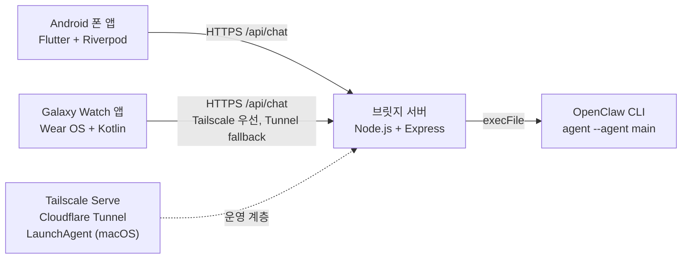

# 제이미 (Jamie) — AI 음성 비서


Galaxy Watch + Android 폰에서 동작하는 PTT(Push-to-Talk) AI 음성 비서

## 주요 기능

### 폰 앱
- Flutter + Riverpod 기반 채팅 UI
- STT 입력, 브릿지 기반 LLM 응답, TTS 재생
- 세션 저장, 전환, 삭제
- Pretendard 폰트 기반 다크 테마 UI

### 워치 앱
- Wear OS 단독 음성 루프: STT -> LLM -> TTS
- 녹음, 응답 대기, 재생 상태 표시와 진동 피드백
- Tile 탭으로 즉시 PTT 실행
- Tailscale 우선, Cloudflare Tunnel fallback 경로 지원

### 브릿지 서버
- `Node.js` + `Express` 기반 OpenClaw 프록시
- `/api/chat`, `/api/tunnel-url` 엔드포인트 제공
- `OpenClaw CLI` 실행, 30초 타임아웃 및 요청 길이 제한 적용

## 아키텍처 다이어그램



## 기술 스택

- 폰: `Flutter`, `flutter_riverpod`, `speech_to_text`, `flutter_tts`, `Pretendard`
- 워치: `Kotlin`, `Compose for Wear OS`, `SpeechRecognizer`, `OkHttp`, `TextToSpeech`
- 서버: `Node.js`, `Express`, `OpenClaw CLI`
- 인프라: `Tailscale Serve`, `Cloudflare Tunnel`, `LaunchAgent (macOS)`

## 프로젝트 구조

```text
lib/        Flutter 폰 앱
watch/      Wear OS 워치 앱
bridge/     Node.js 브릿지 서버
```

## 사전 준비

- Flutter stable
- Dart SDK 3.3+
- Node.js
- Java 17, Android SDK 35
- Galaxy Watch / Android 폰 마이크 권한
- OpenClaw CLI 실행 환경
- 문서 검증 기준: Flutter 3.41.6, Node 24.13.0

## 설치 방법

### 1. 폰 앱

```bash
flutter pub get
flutter build apk --debug
```

예상 결과: `build/app/outputs/flutter-apk/app-debug.apk`

### 2. 워치 앱

macOS / Linux:

```bash
cd watch
./gradlew assembleDebug
```

Windows:

```powershell
cd watch
.\gradlew.bat assembleDebug
```

예상 결과: `watch/app/build/outputs/apk/debug/app-debug.apk`

### 3. 브릿지 서버

```bash
cd bridge
npm install
node server.js
```

예상 결과: `OpenClaw bridge listening on 0.0.0.0:18790`

## 설정

- Tailscale 연결이 필요합니다. 워치 앱은 Tailscale URL을 먼저 시도하고, 실패 시 Cloudflare Tunnel URL을 fallback으로 사용합니다.
- 폰 앱은 `--dart-define`으로 브릿지 URL과 토큰을 덮어쓸 수 있습니다.

```bash
flutter run --dart-define=OPENCLAW_BASE_URL=https://YOUR_BRIDGE_HOST --dart-define=OPENCLAW_BEARER_TOKEN=YOUR_TOKEN
```

- 브릿지 설정은 `bridge/server.js`의 `PORT`, `TOKEN`, `OPENCLAW` 실행 경로에서 관리합니다.
- 워치 설정은 `watch/app/src/main/kotlin/com/luma3/ptt_watch/BridgeClient.kt`의 `TAILSCALE_URL`, `FALLBACK_URL`, `AUTH_TOKEN`을 브릿지와 동일하게 맞춰야 합니다.

## 운영 메모

- 가장 흔한 실패 원인은 브릿지 `TOKEN`, `URL`, `PORT` 불일치입니다. 폰, 워치, 브릿지 값을 함께 맞추세요.
- Cloudflare Tunnel fallback을 쓰려면 `bridge/tunnel-url.txt`를 공급하는 별도 운영 절차가 필요합니다.
- 문제 발생 시 마지막으로 수정한 `PORT`, `TOKEN`, `TAILSCALE_URL`, `FALLBACK_URL`을 이전 값으로 되돌린 뒤 브릿지를 재시작하세요.
- `bridge/server.js`의 `OPENCLAW` 실행 경로는 환경별로 검증이 필요합니다.

## 스크린샷

TODO — 나중에 추가

## 라이선스

MIT

> 참고: 현재 저장소 루트에는 `LICENSE` 파일이 없습니다. 공개 배포 전 추가를 권장합니다.
