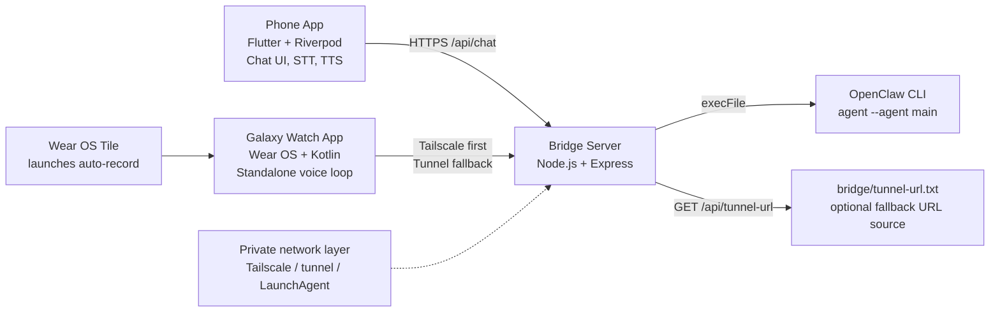

# openclaw-voice

> Voice interface for OpenClaw AI — talk to your AI from phone and Galaxy Watch


Use OpenClaw AI with your voice, anywhere — from your phone or Galaxy Watch.

`openclaw-voice` is a push to talk voice assistant and wearable AI interface for OpenClaw. It connects Android phone and Galaxy Watch clients to a private bridge server, turning speech to text, LLM inference, and text to speech into one continuous voice workflow.

This matters if you want OpenClaw outside the terminal: on the move, on your wrist, and over your own network. The result is a practical `voice assistant` setup for `galaxy watch`, `wear os`, `flutter`, `LLM`, `speech to text`, and `text to speech` use cases without replacing the OpenClaw CLI itself.

## Features

- `Phone App`: Flutter chat UI, microphone input, STT capture, OpenClaw LLM calls, TTS playback, session management, and a dark mode interface.
- `Watch App`: Standalone `galaxy watch` voice loop on Wear OS with STT -> LLM -> TTS, haptic feedback, partial transcript display, and Tile launch support.
- `Bridge Server`: Lightweight Node.js proxy that accepts device requests, runs the local OpenClaw CLI, and returns normalized replies.
- `Private Connectivity`: Tailscale-first routing with optional tunnel fallback for watch access when direct tailnet access is not available.
- `Korean-First Defaults`: Current watch STT/TTS and phone TTS are configured for Korean, with code-level language changes available before build.

## Architecture Diagram



## Tech Stack

| Layer | Stack | Notes |
| --- | --- | --- |
| Phone app | Flutter, `flutter_riverpod`, `speech_to_text`, `flutter_tts`, `shared_preferences` | Android-first push to talk chat client with persisted sessions |
| Watch app | Kotlin, Compose for Wear OS, `SpeechRecognizer`, `TextToSpeech`, OkHttp, Wear Tiles | Standalone `wearable AI` client for Galaxy Watch |
| Bridge server | Node.js, Express | Exposes `/api/chat` and `/api/tunnel-url` |
| OpenClaw runtime | OpenClaw CLI | Invoked as `openclaw agent --agent main --message ...` |
| Connectivity | Tailscale, optional tunnel fallback | Designed for private access instead of a public hosted API |

## Project Structure

```text
.
|-- lib/                 Flutter phone app source
|-- assets/              Fonts and shared app assets
|-- bridge/              Node.js bridge server for OpenClaw CLI
|-- watch/               Standalone Wear OS app
|-- watch_companion/     Separate companion Flutter sandbox
|-- android/             Flutter Android runner for the phone app
|-- ios/                 Flutter iOS runner
|-- linux/               Flutter Linux runner
|-- macos/               Flutter macOS runner
|-- web/                 Flutter web runner
|-- windows/             Flutter Windows runner
`-- test/                Flutter test files
```

## Getting Started

### Prerequisites

- Flutter SDK compatible with Dart `>=3.3.0 <4.0.0`
- Android SDK and Java 17
- Wear OS build toolchain for the `watch/` module (`compileSdk 35`, `minSdk 30`)
- Node.js installed on the bridge host
- Tailscale installed and working on the machine that runs the bridge
- OpenClaw CLI installed on the bridge host
- Android phone and Galaxy Watch microphone permission enabled

Notes:

- The current bridge code points to an OpenClaw binary at `~/.nvm/versions/node/v24.14.0/bin/openclaw`. Adjust that path for your machine before relying on the documented startup flow.
- Public-facing tunnel automation is not fully codified in this repo. Treat that part as runtime validation territory.

### Phone app build

```bash
cd C:/Users/1/projects/ptt-voice-app
flutter pub get
flutter build apk --debug
```

Expected artifact:

```text
build/app/outputs/flutter-apk/app-debug.apk
```

For local runs with an explicit bridge URL and token:

```bash
flutter run --dart-define=OPENCLAW_BASE_URL=https://YOUR_TAILSCALE_HOST --dart-define=OPENCLAW_BEARER_TOKEN=YOUR_TOKEN
```

### Watch app build

macOS or Linux:

```bash
cd C:/Users/1/projects/ptt-voice-app/watch
./gradlew assembleDebug
```

Windows PowerShell:

```powershell
cd C:/Users/1/projects/ptt-voice-app/watch
.\gradlew.bat assembleDebug
```

Expected artifact:

```text
watch/app/build/outputs/apk/debug/app-debug.apk
```

### Bridge server setup

```bash
cd C:/Users/1/projects/ptt-voice-app/bridge
npm install
npm start
```

Expected output:

```text
OpenClaw bridge listening on 0.0.0.0:18790
```

Additional repo assets:

- `bridge/start.sh` starts the server with `node server.js`
- `bridge/ai.openclaw.bridge.plist` is a macOS LaunchAgent example for keeping the bridge alive

## Configuration

### Tailscale setup

1. Run the bridge on a machine that also has OpenClaw CLI installed.
2. Expose that bridge through a reachable private HTTPS URL on your Tailscale network.
3. Point the phone app to that base URL with `OPENCLAW_BASE_URL`.
4. Point the watch app to that full chat endpoint by updating `watch/app/src/main/kotlin/com/luma3/ptt_watch/BridgeClient.kt`.

Current code expectations:

- Phone app expects a base URL such as `https://YOUR_TAILSCALE_HOST`
- Watch app expects a full endpoint such as `https://YOUR_TAILSCALE_HOST/api/chat`

Safety note:

- If the watch cannot reach Tailscale directly, it falls back to the saved tunnel URL and then tries `/api/tunnel-url` from the Tailscale host to discover a fresh fallback.

### Bridge server token and port

Bridge settings are currently hard-coded in `bridge/server.js`:

- `HOST`
- `PORT`
- `TOKEN`
- `OPENCLAW`

You must keep these aligned across all three surfaces:

- Bridge: `bridge/server.js`
- Phone: `OPENCLAW_BEARER_TOKEN` passed through `--dart-define`
- Watch: `BridgeConfig.AUTH_TOKEN` in `watch/app/src/main/kotlin/com/luma3/ptt_watch/BridgeClient.kt`

Primary failure mode:

- `401 Unauthorized` or silent request failure usually means token mismatch.
- `502` at the bridge usually means the local `OPENCLAW` path is wrong or OpenClaw execution failed.

Rollback guidance:

- If a configuration change breaks the app, revert the most recent edits to `PORT`, `TOKEN`, `OPENCLAW`, `TAILSCALE_URL`, and `FALLBACK_URL`, then restart the bridge first before retesting the devices.

### Tunnel fallback

If you use the watch tunnel fallback flow:

- Store only the tunnel base URL in `bridge/tunnel-url.txt`
- Example: `https://example.trycloudflare.com`
- Do not include `/api/chat` in that file; the watch client appends it automatically

### Language settings

Current language behavior in code:

- Phone TTS defaults to Korean in `lib/services/tts_service.dart`
- Watch STT defaults to `ko-KR` in `watch/app/src/main/kotlin/com/luma3/ptt_watch/SttManager.kt`
- Watch TTS defaults to `Locale.KOREAN` in `watch/app/src/main/kotlin/com/luma3/ptt_watch/PttViewModel.kt`
- Phone STT currently relies on the device speech recognizer defaults in `lib/services/stt_service.dart`

To change languages, update those constants before building. The repo is Korean-first today, but the `voice assistant` flow itself is not tied to Korean.

## How It Works

1. The phone app or Galaxy Watch captures your speech with local STT.
2. The client sends the recognized text to the bridge server over `/api/chat`.
3. The bridge validates the bearer token, builds a prompt, and runs OpenClaw CLI locally.
4. OpenClaw returns a reply, which the bridge normalizes into JSON.
5. The client renders the response, plays TTS, and on the phone persists the chat session for later reuse.

Watch-specific behavior:

- The watch tries the Tailscale endpoint first.
- If that fails, it tries the saved fallback tunnel URL.
- If needed, it asks the bridge for a new fallback URL through `/api/tunnel-url`.

## License

MIT.

Note: this repository currently does not include a root `LICENSE` file. Add one before public distribution so the license grant is explicit.

## 한국어 (Korean)

`openclaw-voice`는 OpenClaw를 폰과 Galaxy Watch에서 음성으로 사용할 수 있게 만드는 프로젝트입니다. Flutter 기반 안드로이드 폰 앱, Kotlin 기반 Wear OS 워치 앱, 그리고 OpenClaw CLI를 호출하는 Node.js 브리지 서버로 구성됩니다. 핵심 목표는 터미널 밖에서도 자연스러운 `push to talk` 경험을 제공하는 것입니다. 즉, `openclaw`, `LLM`, `speech to text`, `text to speech`, `wear os`, `galaxy watch` 흐름을 하나의 실사용 가능한 음성 인터페이스로 묶는 데 초점을 둡니다.

주요 기능:

- 폰 앱: Flutter 채팅 UI, 음성 입력, OpenClaw 응답 호출, TTS 재생, 세션 저장/전환/삭제
- 워치 앱: Galaxy Watch 단독 음성 루프, 타일에서 즉시 실행, 진동 피드백, Tailscale 우선 연결
- 브리지 서버: OpenClaw CLI 프록시, `/api/chat` 및 `/api/tunnel-url` 제공
- 한국어 우선 설정: 현재 워치 STT/TTS와 폰 TTS가 한국어 기준으로 구성됨

자세한 설정 방법은 위 영어 문서를 참조하세요.
